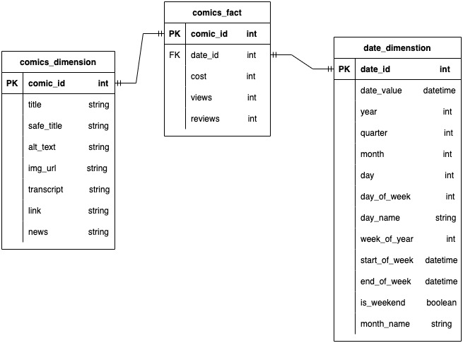
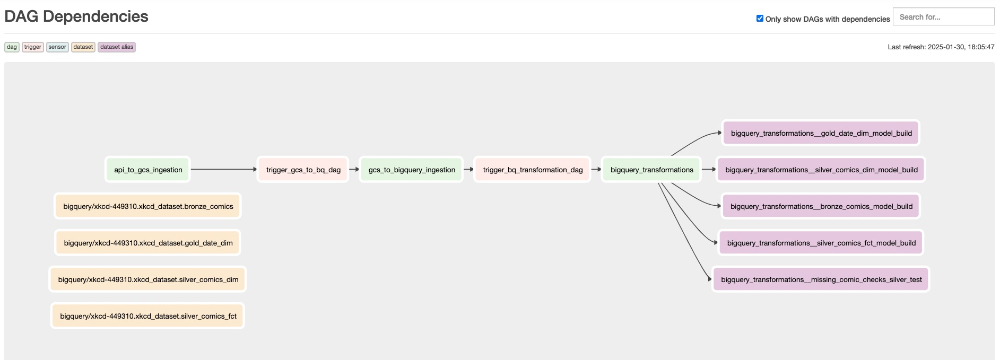
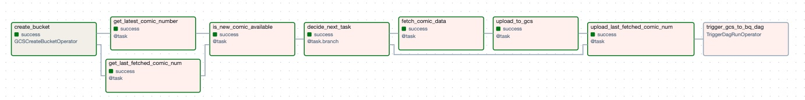
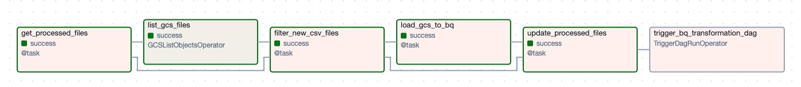
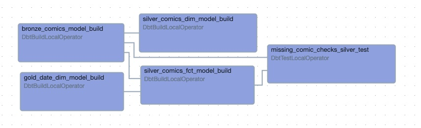

# Project Setup: Docker + dbt + Airflow + BigQuery  

## Prerequisites  

Ensure you have the following installed:  
- **Docker**: [Install Docker](https://docs.docker.com/get-docker/)  
- **Google Cloud SDK** (for authentication with BigQuery): [Install SDK](https://cloud.google.com/sdk/docs/install)  
- **gcloud CLI authenticated**:  the JSON secret file will be shared in the zip file

---

## **Get Started**  

### step 1: 
Download astro

Download dbt, dbt-bigquery

Download apache-airflow

### step 2: 
Navigate to your project directory and start the Astro environment by typing the command below into the terminal
```bash
astro dev start
```
This will start Airflow Scheduler, Webserver and load your DAGs & dbt Project

### step 3: 
After the docker is built successfully, open the airflow web UI (by default http://localhost:8080/), add the Google Cloud connection using the secret.json file

---

## Star Schema (ERD)


## DAG dependencies


## Staging Pipeline (from API to Google Cloud Storage)


## Onboarding Pipeline (from Google Cloud Storage to BigQuery)


## Master Pipeline (Transformation in BigQuery)

